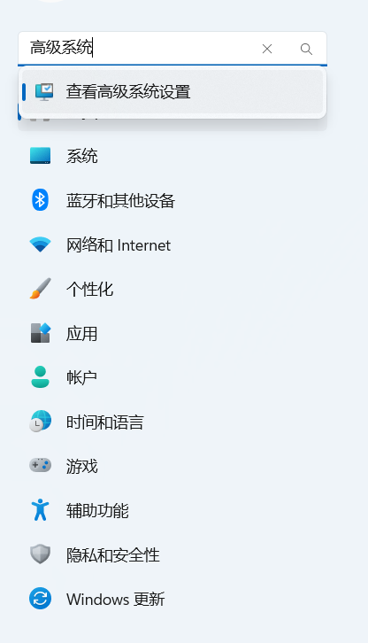
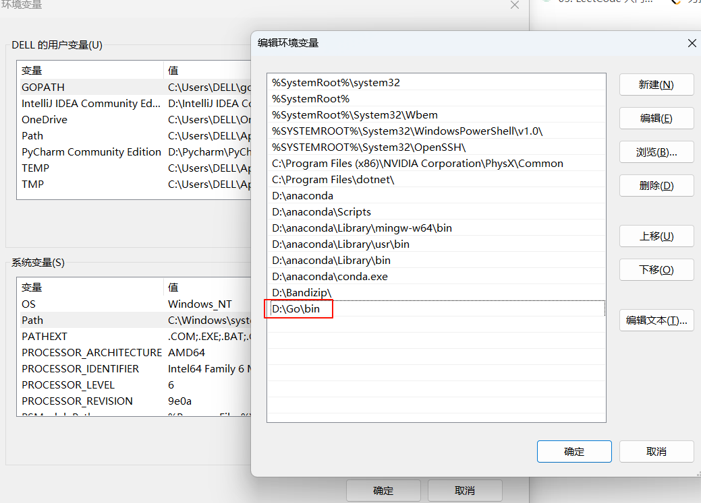
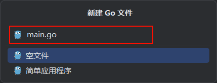

# GoLang开发环境搭建

本章节我们主要学习golang开发环境搭建的相关内容，包括

- golang开发环境搭建
- 第一个hello world程序
- import包与package
- go get与第三方包
- go mod包管理

通过本章节的学习，您将完成本地golong开发环境的构建，并完成自己的第一个golong程序的编写，对golang有一个初步的了解。


## 1. golang开发环境搭建

### 1.1 go sdk下载

- 下载地址:[sdk官网](https://golang.google.cn/dl/)

- 下载教程：

  - 下载安装包

    

  - 下载后直接点击安装即可

  - 一路next

  - 选择安装路径（**记住安装路径，后续需要添加环境变量**）

    

  - 最后install安装即可

- 添加Go到环境变量

  - 打开高级系统设置（win11直接在设置中搜索即可）

    

    - 在环境变量下的系统变量下找到path变量，并直接编辑（**好像已经自动安装，可以看一看自己本地有没有**）

      

  - 填入之后记得有**两次确认**要点

- 验证

  - 使用cmd验证即可（win + r，在输入框输入cmd回车即可）

  - 验证命令：go version

    


- 到此，sdk安装成功

### 1.2 go开发工具：Goland

- 开发工具简介：GoLand 是由 JetBrains 公司开发的一款专为 Go 语言设计的集成开发环境（IDE）。

- 下载地址：[goland官网](https://www.jetbrains.com/go/)

  - 下载速度比较慢

- 安装教程

  - 下载后直接双击安装包（.exe文件）安装

  - 选择安装地址（一般选在c盘之外）

    

  - 选择创建桌面快捷方式

    

  - 直接安装即可

- goland配置

  - 直接双击桌面快捷方式启动即可

  - 启动后选择中国地区

  - 选择30天免费试用

  - 选择新建项目

    

  - 选择文件路径、本地sdk以及环境变量

    

  - 选择创建项目即可

到此，我们的开发环境已经准备完成了。接下来，我们将开始我们的第一个hello world程序。

## 2. 第一个hello world程序

### 2.1 创建一个go文件




### 2.2 编写代码

```go
package main

import "fmt"

func main() {
	fmt.Println("hello world")
}

```

下面我们来对上面编写的代码做一个简单的说明

- package main：定义包名，在我们编写go文件时，我们必须在非注释的第一行指明这个文件属于哪个包
- import "fmt"：告诉Go编译器我们这个程序需要用到fmt包（**包可以理解为一个箱子，里面包含一些方法或者其他元素我们可以直接调用**）
- func main():程序开始执行的函数。main 函数是每一个可执行程序所必须包含的，一般来说都是在启动后第一个执行的函数。
- fmt.Println("hello world")：我们调用fmt包下的Println方法，Println方法可以将我们需要打印的内容打印出来
- {}：函数具体的内容被一个{}包括住

### 2.3 运行代码

- 直接在代码右键在选项中选择运行（run）即可

  

上面我们就成功运行了我们第一个程序啦。

## 3. import包与package

在这一个章节，我们来讲一下包（package）

### 3.1 包的概念

在go语言中，包（package）是组织代码的基本单位。通过将相关的功能代码放在同一个包中，可以提高代码的可维护性和复用性。每个包下可以存放多个.go文件


### 3.2 创建包

- 创建目录：首先，为你的包创建一个目录。例如，假设我们要创建一个名为`mathutil`的包。（我在这里重开了一个go_mod_demo的项目）

  

- **编写代码**：在`mathutil`目录下创建一个或多个`.go`文件。每个文件的第一行应该是`package mathutil`，表示这个文件属于`mathutil`包。

  ```go
  package mathutil
  
  func Add(a, b int) int {
      return a + b
  }
  
  func Subtract(a, b int) int {
      return a - b
  }
  ```


### 3.3 使用包

- 导入包：在需要使用`mathutil`包的文件中，使用`import`语句导入该包

  ```go
  package main
  
  import (
  	"fmt"
  	"go_mod_demo/mathutil"
  )
  
  func main() {
  	sum := mathutil.Add(3, 5)
  	diff := mathutil.Subtract(10, 7)
  	fmt.Println("Sum:", sum)
  	fmt.Println("Difference:", diff)
  }
  ```


## 4. go get与第三方包

除了标准库，go语言还拥有丰富的第三方包生态系统。我们可以通过go get命令安装第三方包，并在我们的项目中使用它

### 4.1 安装第三方包

例如，我们安装github.com/gorilla/mux，在终端中输入如下命令：

```go
go get github.com/gorilla/mux
```


### 4.2 导入并使用第三方包

```go
package main

import (
	"fmt"
	"github.com/gorilla/mux"
	"net/http"
)

func main() {
	r := mux.NewRouter()
	r.HandleFunc("/", func(w http.ResponseWriter, r *http.Request) {
		fmt.Fprintf(w, "Hello, World!")
	})
	http.ListenAndServe(":8080", r)
}

```

运行程序后在本地浏览器访问链接http://localhost:8080/，即可看到结果。

## 5. go mod包管理

### 5.1 什么是go mod

go mod是Go 1.11版本引入的一个依赖管理工具。它通过go.mod文件来记录项目的依赖关系，确保项目在不同环境中的一致性。使用go mod，你可以轻松地管理项目的依赖包，包括**下载、更新和版本控制**。

### 5.2 go.mod文件内容解析

以一个go.mod文件举例，我们可以简单的了解一下go.mod文件中的内容

```go
module modexample

go 1.16

require (
    github.com/spf13/viper v1.9.0
    github.com/stretchr/testify v1.7.0
)
```

- module modexample:声明这是一个模块，模块名称为modexample。在项目中，模块名称通常是项目的主要包名或项目的唯一标识符。
- go 1.16：表示项目至少需要Go1.16版本才能编译和运行
- require关键字：声明项目依赖的外部模块及其版本
- github.com/spf13/viper v1.9.0：表示项目依赖github.com/spf13/viper模块的v1.9.0版本
- github.com/stretchr/testify v1.7.0：表示项目依赖github.com/stretchr/testify模块的v1.7.0版本

以上是一个对于go.mod文件的简单说明。后面我们遇到了会再详细讲解。

### 5.3 go mod的基础功能

#### 5.3.1 下载依赖

下载依赖有两种方式

- 运行项目时，go会自动下载所需要的包，并更新go.mod文件

- 手动下载依赖

  ```sh
  go mod download
  ```

#### 5.3.2 更新依赖

- **更新所有依赖**

  - 使用go mod tid命令清理不必要的依赖并更新go.mod文件。

    ```sh
    go mod tidy
    ```

- **更新特定依赖**

  - 使用go get命令更新特定依赖的版本。例如，更新viper到最新版本或者更新到特定版本

    ```sh
    go get -u github.com/spf13/viper
    go get github.com/spf13/viper@v1.9.0
    ```

#### 5.3.3 查看依赖

- 通过查看go.mod文件查看依赖

- 使用go list命令查看项目的依赖关系

  ```sh
  go list -m all
  ```

### 5.4 go mod项目结构

一个典型的使用go.mod的项目结构如下

```
modexample/
├── go.mod
├── go.sum
├── main.go
└── config.yaml
```

- **go.mod**：记录项目的模块名称和依赖关系。
- **go.sum**：记录每个依赖包的校验和。
- **main.go**：项目的主文件。
- **config.yaml**：配置文件。


以上就是我们这个章节的全部内容啦，也许还有没有考虑到的地方，后续还会继续的完善。大家如果对某方面的存在疑问的话可以直接提出来
